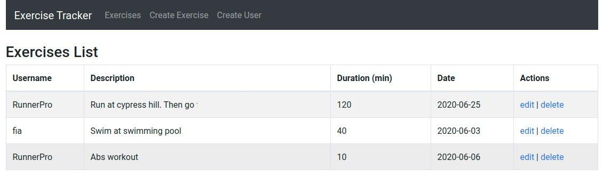

# Simple Exercises Tracker

Simple Exercises/Task tracker single-page application built using the MERN stack.

You can create users, create exercises for an user and edit or delete them.



### Requirements

* [Node.js](https://docs.npmjs.com/downloading-and-installing-node-js-and-npm)
* [MongoDB](https://docs.mongodb.com/manual/installation/)

## Getting Started

Clone the project.

```
git clone https://github.com/jsanhuez/exercise-tracker.git
```

Go to project folder

```
cd exercise-tracker
```

Install Front-end dependencies

```
npm install
```

Go to project backend folder

```
cd backend
```

Install Back-end dependencies

```
npm install
```

## Run Project

Start MongoDB

```
sudo service mongod start
```

In backend folder, start server

```
:~/exercise-tracker/backend$ npm run dev
```

Then, go to root project 

```
:~/exercise-tracker/backend$ cd ..
```

and run project

```
:~/exercise-tracker$ npm start
```

And enjoy!


## Author

* **Juan Sanhueza Rodríguez** - [Juan SR](https://github.com/jsanhuez)